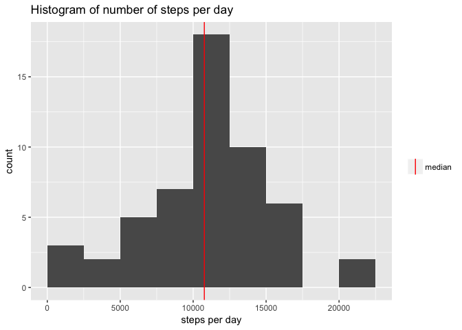

# Reproducible Data - Project 1

### Loading and preprocessing the data  

Unziping and reading the 'activity' data file.

```r
activity <- read.csv(unz("activity.zip", "activity.csv"))
```

Converting the variable 'date' to class Date.

```r
activity$date <- as.Date(activity$date, format = "%Y-%m-%d")
```


### Mean total number of steps taken per day  

Calculating the total number of steps taken each day (ignoring NAs).

```r
library(dplyr)
byday <- activity %>% 
        group_by(date) %>%
        summarise(steps = sum(steps))
```

Histogram of the total number of steps taken each day (ignoring NAs).

```r
library(ggplot2)
ggplot(data = subset(byday, !is.na(steps)), aes(steps)) + 
        geom_histogram(breaks = seq(0, 22500, 2500)) +
        labs(title = "Histogram of number of steps per day", x = "steps per day") +
        geom_vline(aes(xintercept = median(byday$steps, na.rm = TRUE), colour = "median")) +
        scale_color_manual(name = "", values = c(median = "red"))
```

<!-- -->

Calculating the mean and median of the number of steps taken each day.

```r
mnsteps <- mean(byday$steps, na.rm = TRUE)
medsteps <- median(byday$steps, na.rm = TRUE)
```

Mean : 10766.19 steps per day  
Median : 10765 steps per day

### Average daily activity pattern  

Making a time series plot of the 5-minute interval and the average number of steps taken, averaged across all days.


```r
byint <- activity %>% 
        group_by(interval) %>%
        summarise(mean = mean(steps, na.rm = TRUE))

ggplot(byint, aes(interval, mean)) +
        geom_line() +
        labs(title = "Mean number of steps taken in 5-min intervals, averaged across all days", x = "intervals", y = "number of steps")
```

<!-- -->

Finding which 5-minute interval, on average across all the days in the dataset, contains the maximum number of steps.

```r
intmax <- byint[which.max(byint$mean), 1]
```
Interval : 835

### Imputing missing values

Calculating the total number of missing values in the dataset.

```r
sum(is.na(activity))
```

```
## [1] 2304
```

Creating a new data set 'complete', equal to 'activity', but with the missing values filled-in with the mean for the corresponding 5-min interval.

```r
complete <- activity
for(i in 1:length(complete$steps)) {
        if(is.na(complete[i,1])) {
                complete[i,1] <- byint[which(byint$interval == complete[i,3]), 2]
        }
}
```

Histogram of the total number of steps taken each day (with filled-in NAs).

```r
complete_byday <- complete %>% 
        group_by(date) %>%
        summarise(steps = sum(steps))

ggplot(data = complete_byday, aes(steps)) + 
        geom_histogram(breaks = seq(0, 22500, 2500)) +
        labs(title = "Histogram of number of steps per day", x = "steps per day") +
        geom_vline(aes(xintercept = median(complete_byday$steps, na.rm = TRUE), colour = "median")) +
        scale_color_manual(name = "", values = c(median = "red"))
```

<!-- -->

Calculating the mean and median of the number of steps taken each day (with filled-in NAs).

```r
complete_mn <- mean(complete_byday$steps)
complete_med <- median(complete_byday$steps)
```

New mean : 10766.19 steps per day  
Mean ignoring NAs : 10766.19 steps per day  

New median : 10766.19 steps per day  
Median ignoring NAs : 10765 steps per day

*The impact of imputing missing data appears to be negligible for the estimates of the total daily number of steps.*

### Comparison of activity patterns between weekdays and weekends


```r
complete$status <- factor(ifelse(weekdays(complete$date) %in% c("Saturday", "Sunday"), "weekend", "weekday"))

complete_byint <- complete %>% 
                group_by(status, interval) %>%
                summarise(mean = mean(steps))

ggplot(complete_byint, aes(interval, mean)) + 
        geom_line() +
        facet_grid(status~.) +
        labs(title = "Average number of steps taken, in 5-min intervals,\n across weekdays or weekend days", y = "number of steps", x = "intervals") +
        theme(plot.title = element_text(hjust = 0.5))
```

<!-- -->

